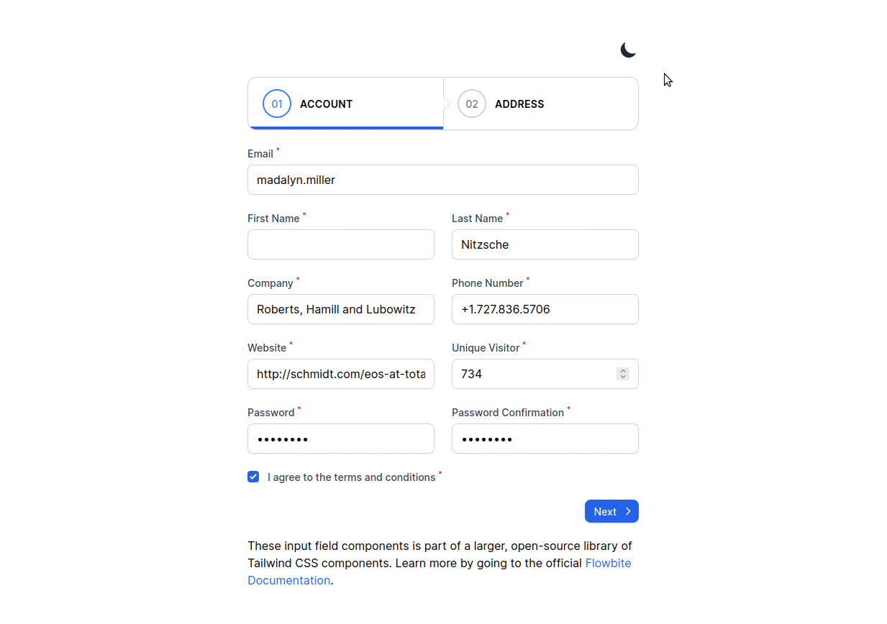

# Cadastro de Lead com Form Builder

Este é um projeto Laravel que utiliza o Form Builder do FilamentPHP para criar uma página de cadastro de Lead.

[](https://wakatime.com/badge/user/a123514e-1d04-4b39-aaac-69ab598cacd9/project/73cff5b3-3026-4596-a8f5-24b48c8d326c)

## Funcionamento



## Pré-requisitos

* PHP 8.0 ou superior
* Laravel 8.0 ou superior
* livewire 2.0 ou superior
* Composer

## Instalação

1. Clone o repositório para sua máquina local:

```bash
git clone https://github.com/eduardo-rogerio/Laravel-Form-Builder.git
```

2. Instale as dependências com o Composer:

```bash 
composer install
```

3. Copie o arquivo `.env.example` para `.env` e configure as variáveis de ambiente:

```bash 
cp .env.example .env
```

4. Gere uma chave para a aplicação:

```bash
php artisan key:generate
```

5. Rode as migrations para criar as tabelas do banco de dados:

```bash
php artisan migrate
```

6. Rode o servidor de desenvolvimento:

```bash
php artisan serve
```

7. Acesse o formulário no navegador em `http://localhost:8000/register/create`

## Licença

Este projeto está licenciado sob a Licença MIT. Consulte o arquivo [LICENSE](LICENSE) para obter mais informações.
